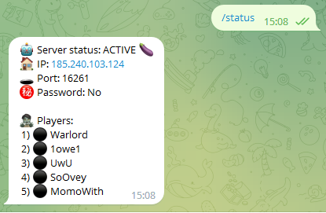
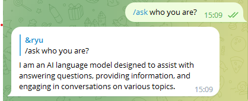

# Project Zomboid server now in Telegram!

## Description

When me and my friends was playing in pz with our own dedicited server i discovered that regular server restarts (mods updates or something) become ARE REALLY ANNOYING. My friends dont know how to use hosting, all stuf with deploy and server managing was in my shoulders and in one of the day i tiried of this.

So welcome - this is a more human way of PZ server managing!

## Prelude
This project based on: https://github.com/Danixu/project-zomboid-server-docker. Thank you man, this you wrote a really good docker implementation!

## Requirements

First of all you need host machine with installed docker, docker-compose, mysql 8, php-cli (8.1+) with PDO extension and composer. Yeah, looks huge, maybe in someday i modify Danixu docker implementation with out-the-box support of php and mysql, but now i think this is not a big deal: many of nowedays VPS has all of that inside.

## Configuration

You should use .env.template file like this:

```bash
cp .env.tamplate .env
```

And put in there some of the params, take a look for some of them.

### Requierd

This is params for base-bot-usage (commands /up, /down, /restart and /status):

```env
# mysql host and port can be default if 
# you have default mysql dist
# other params ARE REQUIRED
DB_HOST=127.0.0.1   
DB_PORT=3306
DB_NAME=pzbot
DB_USER=pzbot
DB_PASS=

# Telegram bot API key, bot name and
# admin tg-ids for server managing (via ',')
# (REQUIRED)
BOT_API_KEY=
BOT_USERNAME=
BOT_ADMIN_IDS=
```

Without them bot will be dosen't work!

### Option params

1. ChatGPT integration (this open /ask @message@ command):

```env
# CHATGPT OPTION
BOT_CHATGPT_API_KEY=
```

2. ChatGPT special group messages (timezone GMT!!! and only russian support):

```env
# SHEDULER MESSAGES FROM CHATGPT (time based on GMT+0 in H:i format, only russian support)
BOT_CHATGPT_GOOD_MORNING_TIME='09:00'
BOT_CHATGPT_GOOD_NIGHT_TIME='23:00'
```

3. Media:

```env
# MEDIA OPTION
BOT_UPLOAD_PATH="data/upload"
BOT_DOWNLOAD_PATH="data/download"
```

Other options im not recomend to change becouse project still in pre-pre-pre-pre-pre alpha-gamma release state.

## Installation

When you add all of steps above you can tap:

```bash
composer install
```

Run migrations:

```bash
php bot_intsall.php
```

And run bot app in cron (sudo is required cause for up and down docker commands we need sudo rules, sorry, i promise that im not steel your hosting for criminal interests):
```bash
sudo php bot_cron.php
```

## Results

Status command:



Ask command:



## Credits

You can also read original fork readme:
https://github.com/Danixu/project-zomboid-server-docker